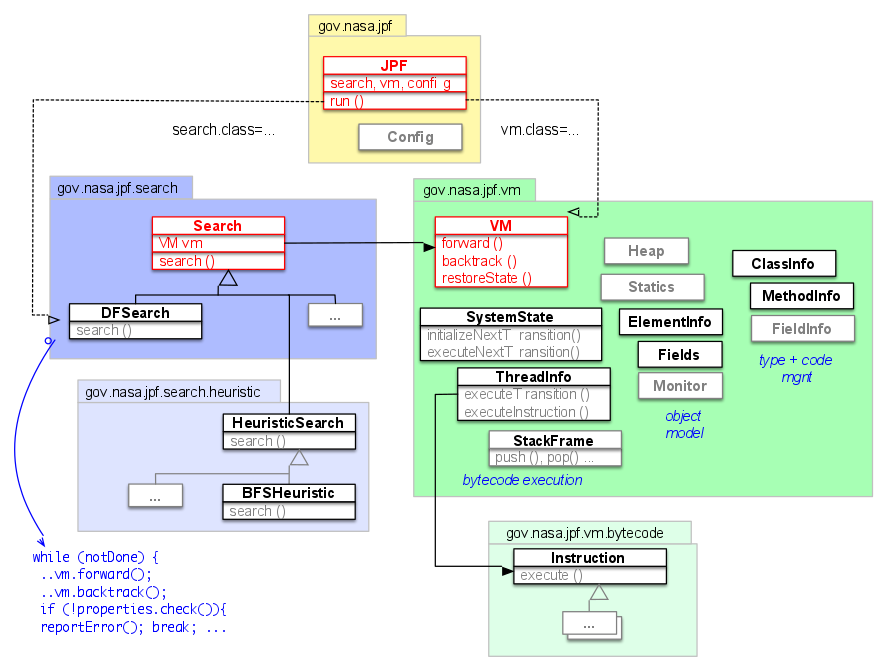

# JPF Top-level Design #

JPF was designed around two major abstractions: (1) the *VM*, and (2) the *Search* component.

## Virtual Machine (VM) ##

The VM is the state generator. By executing bytecode instructions, the VM generates state representations that can be

  * checked for equality (if a state has been visited before)
  * queried (thread states, data values etc.)
  * stored
  * restored

The main VM parameterizations are classes that implement the state management (matching, storing, backtracking). Most of the execution scheme is delegated to `SystemState`, which in turn uses `Scheduler`  to generate scheduling sequences of interest.

There are three key methods of the VM employed by the Search component:

  * `forward` - generate the next state, report if the generated state has a successor. If yes, store on a backtrack stack for efficient restoration.
  * `backtrack` - restore the last state on the backtrack stack
  * `restoreState` - restore an arbitrary state (not necessarily on the backtrack stack)

{align=center width=720}

## Search Strategy ##

At any state, the Search component is responsible for selecting the next state from which the VM should proceed, either by directing the VM to generate the next state (`forward`), or by telling it to backtrack to a previously generated one (`backtrack`). The Search component works as a driver for the VM.

The Search component can be configured to check for certain properties by evaluating property objects (e.g. `NotDeadlockedProperty`, `NoAssertionsViolatedProperty`).

The object encapsulating this component includes a search method which implements a strategy used to traverse the state space. The state space exploration continues until it is completely explored, or a property violation is found.
 The Search component can be configured to use different strategies, such as depth-first search (`DFSearch`), and priority-queue based search that can be parameterized to do various search types based on selecting the most interesting state out of the set of all successors of a given state (`HeuristicSearch`).

## Package Structure ##

The implementation of the JPF core is partitioned into the following packages:

### `gov.nasa.jpf` ###
The main responsibility of this package is configuration and instantiation of the core JPF objects, namely the Search and VM. The configuration itself is encapsulated by the `Config` class, which contains various methods to create objects or read values from a hierarchy of property files and command line options (see Configuring JPF Runtime Options). Beyond the configuration, the JPF object has little own functionality. It is mainly a convenience construct to start JPF from inside a Java application without having to bother with its complex configuration.

### `gov.nasa.jpf.vm` ###
This package constitutes the main body of the core code, including the various constructs that implement the Java state generator. Conceptually, the major class is VM, but again this class delegates most of the work to a set of second level classes that together implement the major functionality of JPF. These classes can be roughly divided into three categories:

(1) class management - classes are encapsulated by `ClassInfo` which mostly includes invariant information about fields and methods captured by `FieldInfo` and `MethodInfo`, respectively.

(2) object model - all object data in JPF is stored as integer arrays encapsulated by `Fields` objects. The execution specific lock state of objects is captured by `Monitor` instances. `Fields` and `Monitor` instances together form the objects, which are stored as `ElementInfo`. The heap contains a dynamic array of `ElementInfo` objects where the array indices being used as object reference values

(3) bytecode execution - the execution of bytecode instructions is performed through a collaboration of `SystemState` and `ThreadInfo`, which is also delegated to policy objects implementing the partial order reduction (POR). It starts with the `VM` object calling `SystemState.nextSuccessor()`, which descends into `ThreadInfo.executeStep()` (together, these two methods encapsulate the on-the-fly POR), which in turn calls `ThreadInfo.executeInstruction()` to perform the bytecode execution.
The actual execution is again delegated to bytecode specific Instruction instances that per default reside in a sub-package `gov.nasa.jpf.vm.bytecode` (the set of bytecode classes to use can be configured via a `InstructionFactory` class which allows the user to define a different execution semantics)

### `gov.nasa.jpf.search` ### 
This package is relatively small and mainly contains the `Search` class, which is an abstract base for search policies. The major method that encapsulates the policy is `Search.search()`, which is the VM driver (that calls the methods`forward`, `backtrack` and `restore`). This package also contains the plain-vanilla depth-first search policy `DFSearch`.
More policies can be found in the sub-package `gov.nasa.jpf.search.heuristic`, which uses a `HeuristicSearch` class in conjunction with configurable heuristic objects to prioritize a queue of potential successor states.
