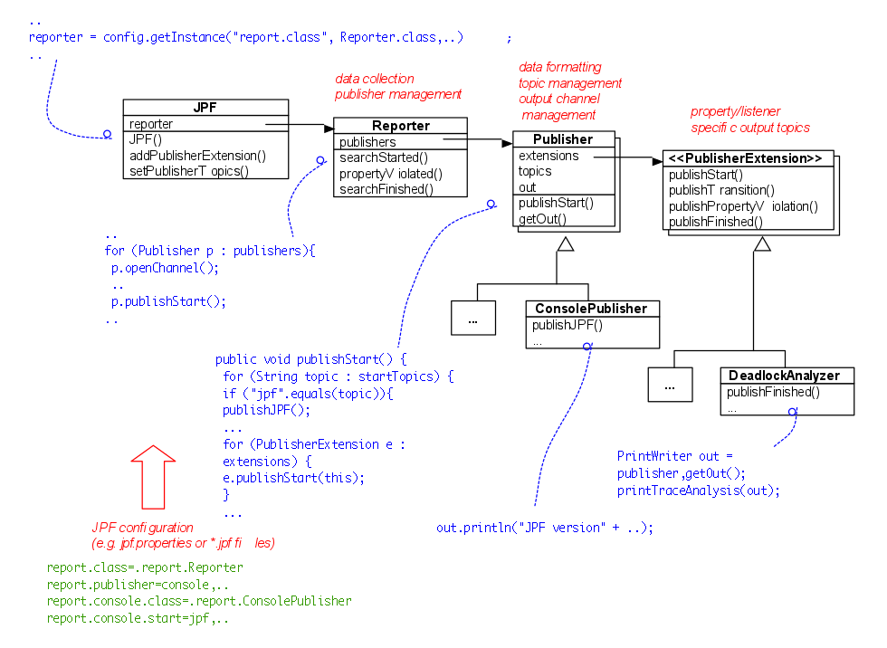

# The JPF Report API #
The JPF report system consists of three major components: 

  - the `Reporter`
  - any number of format specific `Publisher` objects
  - any number of tool-, property-, Publisher-specific `PublisherExtension` objects

Here is the blueprint:

{align=center width=800}

The `Reporter` is the data collector. It also manages and notifies `Publisher` extensions when a certain output phase is reached. The `Publishers` are the format (e.g. text, XML) specific output producers, the most prominent one being the `ConsolePublisher` (for normal, readable text output on consoles). `PublisherExtensions` can be registered for specific `Publishers` at startup time, e.g. from Listeners implementing properties or analysis modes such as `DeadlockAnalyzer`. This is so common that the `ListenerAdapter` actually implements all the required interface methods so that you just have to override the ones you are interested in.

Configuration is quite easy, and involves only a handful of JPF properties that are all in the report category. The first property specifies the Reporter class itself, but is not likely to be redefined unless you have to implement different data collection modes.

~~~~~~~~ {.bash}
report.class=gov.nasa.jpf.report.Reporter
~~~~~~~~

The next setting specifies a list of Publisher instances to use, using symbolic names:

~~~~~~~~ {.bash}
report.publisher=console,xml
~~~~~~~~

Each of these symbolic names has to have a corresponding class name defined:

~~~~~~~~ {.bash}
report.console.class=gov.nasa.jpf.report.ConsolePublisher
~~~~~~~~

Finally, we have to specify for each symbolic publisher name and output phase what topics should be processed in which order, e.g.

~~~~~~~~ {.bash}
report.console.property_violation=error,trace,snapshot
~~~~~~~~

Again, the order of these topics matters, and gives you complete control over the report format. As usual, please refer to `defaults.properties` for default values.

Publisher classes can have their own, additional properties. For instance, the `ConsolePublisher` implementation can be further configured with respect to the information that is included in traces (bytecodes, method names etc.), and to redirect output (file, socket). Please refer to the constructor of this class for further details.

~~~~~~~~ {.bash}
# save report to file
report.console.file=My_JPF_report
~~~~~~~~

All of the involved core classes and interfaces reside in the `gov.nasa.jpf.report` package. The most common way to extend the system is to use your own `PublisherExtension` implementation, which involves two steps:

  - implement the required phase and format specific methods
  - register the extension for a specific Publisher class

The `DeadlockAnalyzer` (which is a listener to analyze concurrency defects) can be used as an example of how to do this:

~~~~~~~~ {.java}
public class DeadlockAnalyzer extends ListenerAdapter {
  ...
  public DeadlockAnalyzer (Config config, JPF jpf){
    jpf.addPublisherExtension(ConsolePublisher.class, this);  // (1)
    ...
  }
  ...
  public void publishPropertyViolation (Publisher publisher) { // (2)
    PrintWriter pw = publisher.getOut();
    publisher.publishTopicStart("thread ops " + publisher.getLastErrorId());
    
    ... // use 'pw' to generate the output
  }
}
~~~~~~~~
